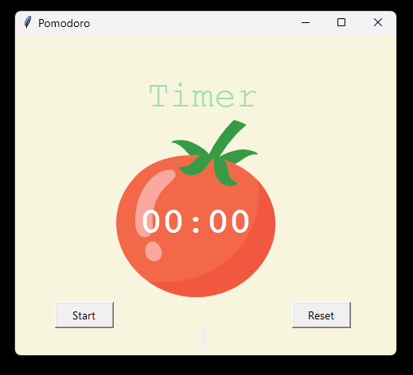

# Pomodoro_app
A Simple Pomodoro app made completely with python converted with Pyinstaller.

Vesion 1.5.1
added sound effects on changing the timer mode.

<h2> Screenshots from the app</h2>

main screen:

work mode:

